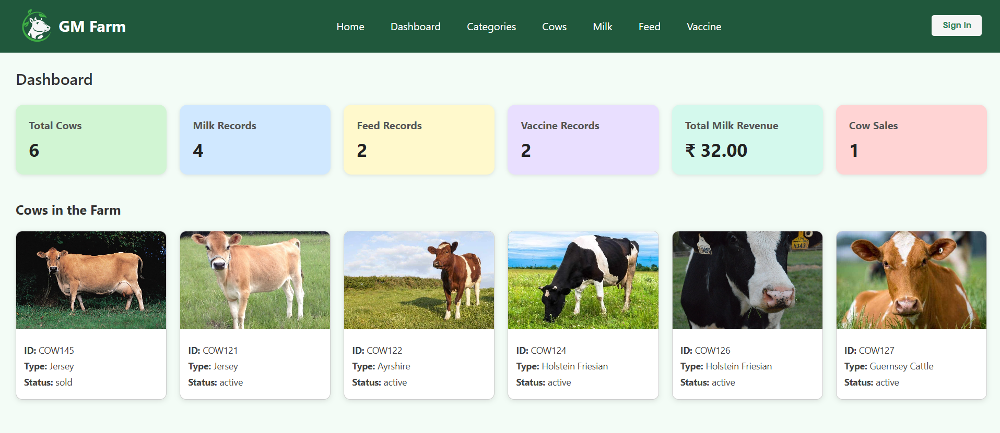

# 🐄 Dairy Farm Management System

A full-stack **Dairy Management System** web application built using **Node.js**, **Express.js**, **MySQL**, and **React**. This project is designed to streamline dairy farm operations, including cow management, milk collection, feed monitoring, vaccination tracking, and sales.

---

## 📸 Screenshots

### 🏠 Homepage  

### 📊 Dashboard  

---

## 🚀 Features

- 🐄 **Cow Management** – Add, view, and manage cow details and categories  
- 🥛 **Milk Collection** – Track daily milk production records  
- 🌾 **Feed Monitoring** – Log and monitor cow feed schedules  
- 💉 **Vaccination Tracking** – Record vaccine history and updates  
- 💰 **Sales Management** – Record both milk and cow sales  
- 📊 **Dashboard** – View real-time summaries and statistics

---

## ⚙️ Tech Stack

| Layer       | Technology        |
|-------------|-------------------|
| Backend     | Node.js, Express.js |
| Database    | MySQL             |
| Frontend    | React, CSS        |
| API Client  | Axios             |

